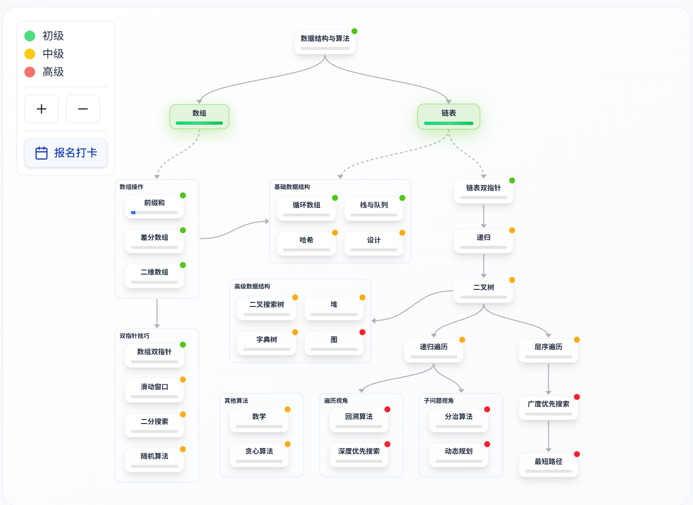

+++
date = '2025-10-15T01:16:03+08:00'
draft = false
title = 'Data_structure_overall'

categories = ["学习记录"]
tags = ["数据结构", "刷题"]

+++
# 数据结构刷题过程记录
## day 1 开始阶段，准备

这个是labuladong算法笔记的速成方案
https://labuladong.online/algo/intro/quick-learning-plan/
 可以看看是个什么情况，对应的板块和常见的算法应该要有哪些。

回忆了一下数组和链表大概需要做什么事情。

